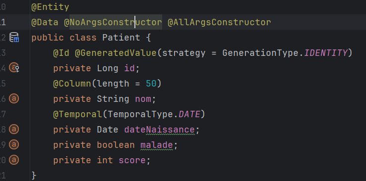
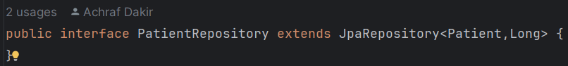
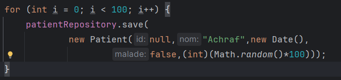
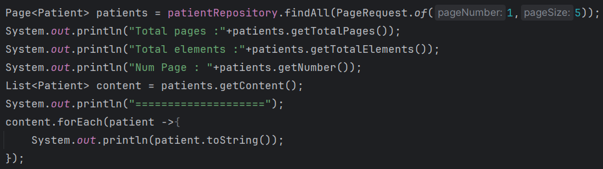
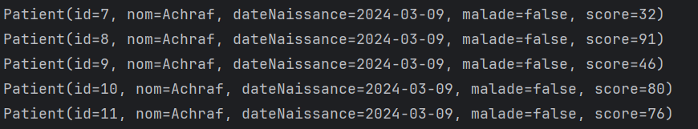
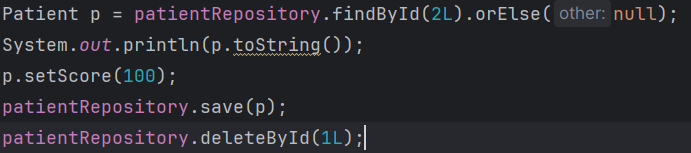

<h2>Activité Pratique N° 2 : ORM, JDBC, JPA Hibernate, Spring data</h2>
<h3>L'entité JPA Patient</h3>

<h3> l'interface JPA Repository basée sur Spring data</h3>

<h3>Opérations de gestion de patients</h3>
<h4>Ajouter des patients</h4>

<h4>Consulter des patients</h4>

Resultat : 

<h4>Mettre à jour ou supprimer un patient</h4>

<h3>H2 database</h3>
